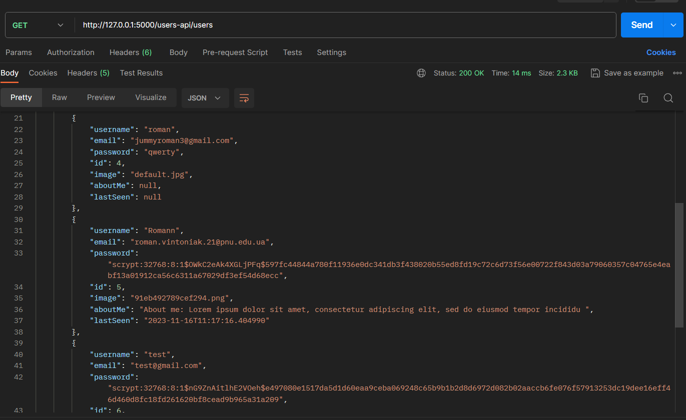
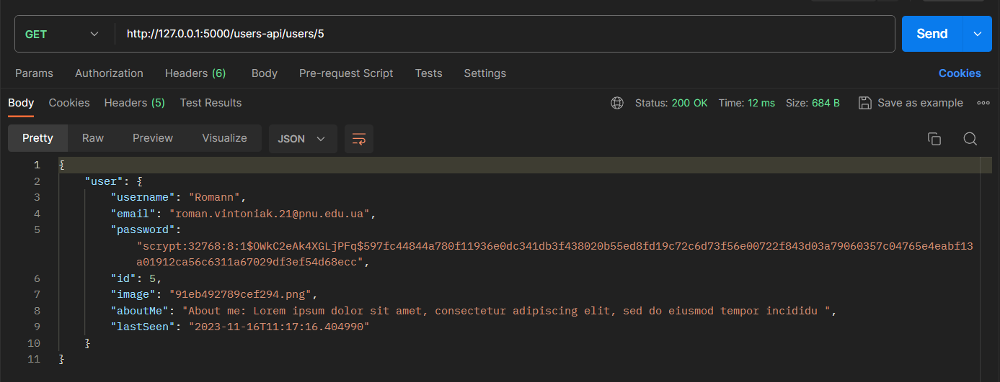
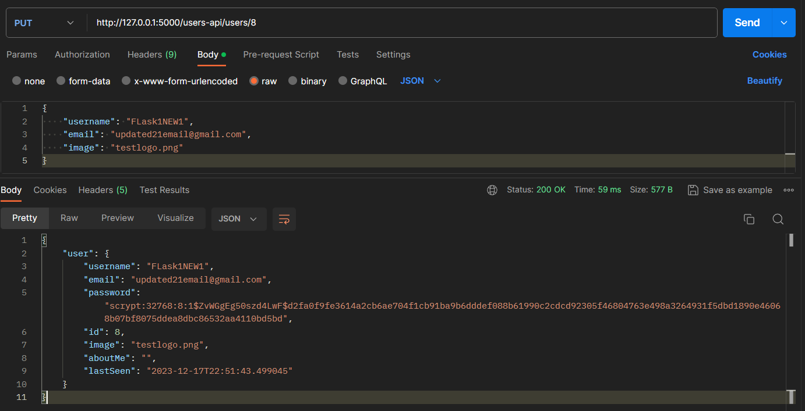
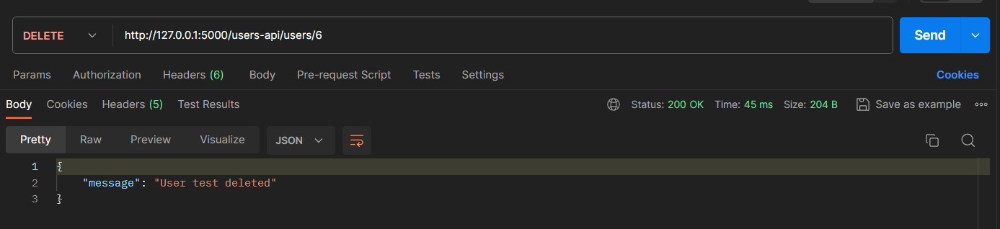
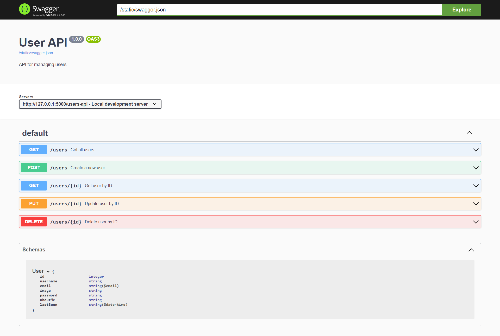

# Lab 15 | RESTful API User
 

<b>GET</b> /users - get list of users  
<b>GET</b> /users/\<id> - get user information  
<b>POST</b> /users  - create a user  
<b>PUT</b> /users/<id> - update user information 
<b>DELETE</b> /users/<id> - delete user  

  

### GET /users 

  

### GET /users/\<id>

  

### PUT /users/\<id>

  

### DELETE /users/\<id>

   

### Swagger

