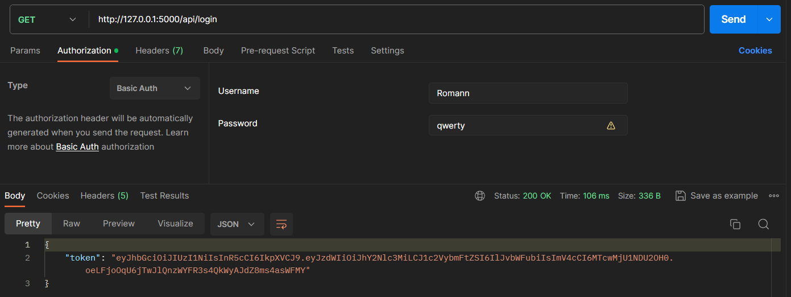
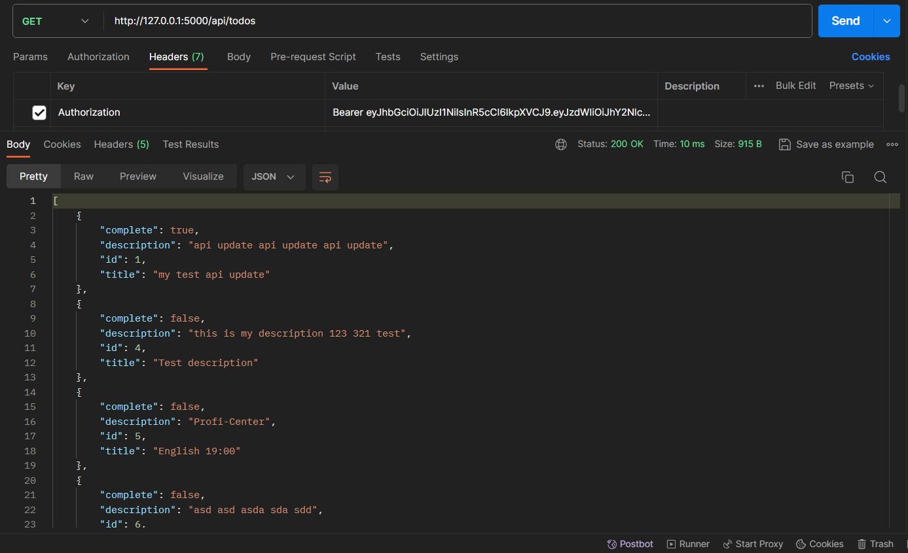
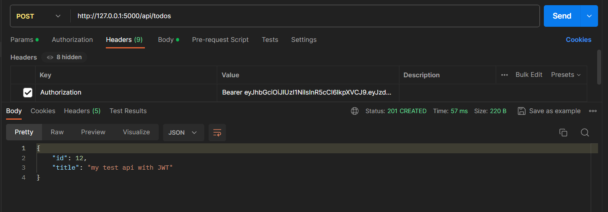
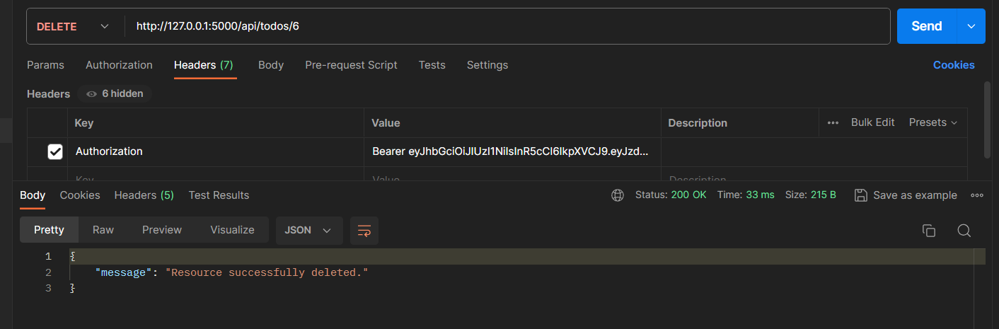
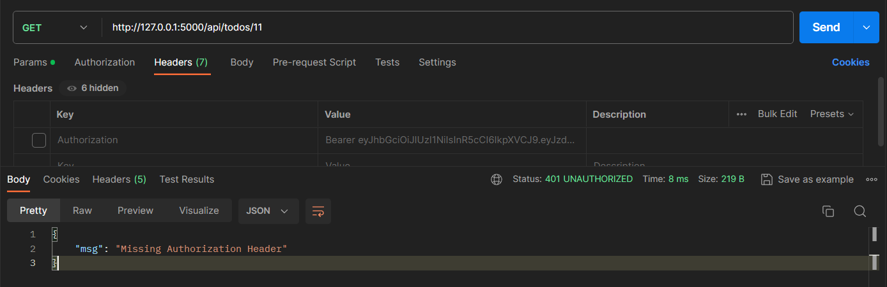
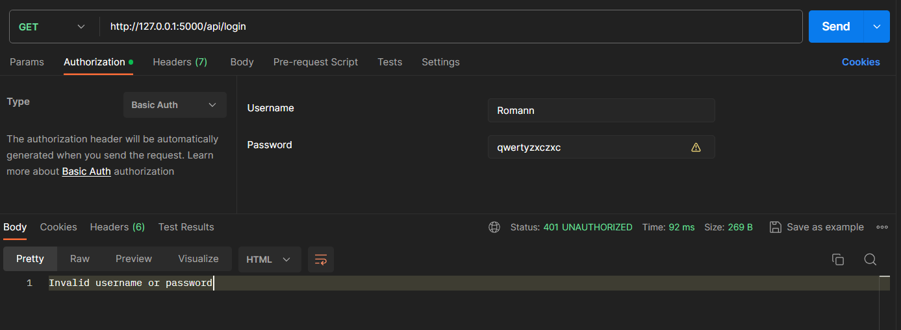

# Lab 14 | JWT
 

<b>GET</b> /login - authentication (respons: JWT)  
<b>GET</b> /todos - get list of todos  
<b>GET</b> /todos/\<id> - get todo information  
<b>POST</b> /todos  - create an  todo  
<b>PUT</b> /todos/<id> - update todo  
<b>DELETE</b> /todos/<id> - delete todo  

  

### GET /login 

  

### GET /todos

  

### POST /todos

  

### DELETE /todos/\<id>

   

### Some examples with errors

 

